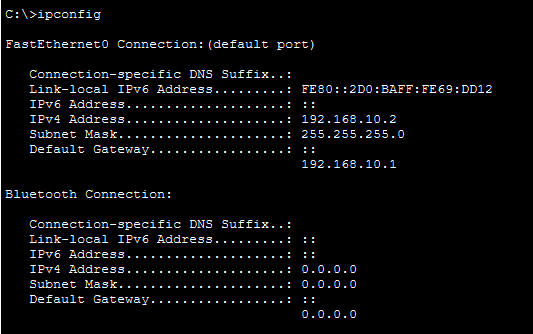

# 🌐 Infraestrutura de Rede Corporativa: Inter-VLAN & DHCP


Projeto prático desenvolvido para a disciplina de Redes de Computadores do curso de **Sistemas de Informação (IFAL)**. O objetivo foi projetar e implementar uma infraestrutura de rede segmentada para três departamentos, garantindo segurança e eficiência no tráfego de dados.

## 📋 Cenário do Projeto

Uma empresa necessita segmentar sua rede física em três departamentos lógicos (**Admin, TI e RH**) para melhorar a segurança e o gerenciamento de tráfego. 

**Requisitos atendidos:**
- [x] Segmentação lógica via **VLANs** (Virtual Local Area Networks).
- [x] Roteamento entre VLANs utilizando a técnica **Router-on-a-Stick**.
- [x] Atribuição dinâmica de IPs via protocolo **DHCP**.
- [x] Conectividade total entre departamentos (Inter-VLAN Routing).

## 🛠️ Topologia e Endereçamento

A rede foi estruturada utilizando endereçamento Classe C (`192.168.x.x`) com máscara `/24`.

| Departamento | VLAN ID | Sub-rede | Gateway Padrão | Faixa DHCP |
| :--- | :---: | :--- | :--- | :--- |
| **Administração** | `10` | `192.168.10.0/24` | `192.168.10.1` | `.10` a `.254` |
| **TI (Técnica)** | `20` | `192.168.20.0/24` | `192.168.20.1` | `.10` a `.254` |
| **Recursos Humanos** | `30` | `192.168.30.0/24` | `192.168.30.1` | `.10` a `.254` |

### Diagrama da Topologia


## ⚙️ Configurações Técnicas

### Switch (Camada 2)
- Criação das VLANs 10, 20 e 30.
- Configuração de **Portas de Acesso** para os computadores finais.
- Configuração de **Link Trunk** (IEEE 802.1Q) para conexão com o roteador.

### Roteador (Camada 3)
- Configuração de **Sub-interfaces** (ex: `g0/0.10`) para gateway de cada VLAN.
- Encapsulamento **dot1Q**.
- Configuração de três **Pools DHCP** distintos para distribuição automática de IPs.

## 🧪 Testes e Evidências

### 1. Teste de Conectividade (Ping)
Teste realizado do **PC-ADMIN (VLAN 10)** para o **PC-TI (VLAN 20)**, comprovando o roteamento entre redes diferentes.


### 2. Obtenção de IP (DHCP)
Confirmação de que os hosts estão recebendo endereços IP, Máscara e Gateway automaticamente.



## 🚀 Como Executar
1. Instale o [Cisco Packet Tracer](https://www.netacad.com/courses/packet-tracer).
2. Clone este repositório:
   ```bash
   git clone https://github.com/VitoriaMarquesnt/ifal-redes-infra-vlan.git
